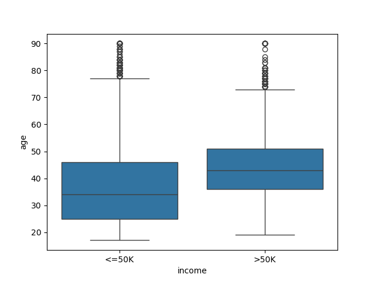
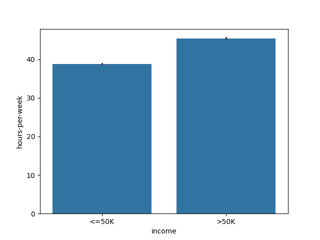

# SalaryPredictionML
Создание классификационных моделей и SVM для предсказания заработка человека по его образованию и возрасту
## Проделанная работа:
- Загрузка и первичный анализ данных
- Визуализация отдельных признаков
- Выбор признаков и кодирование категориальных переменных
- Кодирование целевой переменной

```python
import pandas as pd
from sklearn.linear_model import LinearRegression
from sklearn.model_selection import train_test_split
import matplotlib.pyplot as plt
from sklearn.linear_model import LogisticRegression
from sklearn.preprocessing import LabelEncoder
from sklearn.svm import SVC
import seaborn as sns
import numpy as np
df = pd.read_csv("adult.csv")
df.isnull().sum()
df.shape
df.head()
df.info()

sns.boxplot(x="income", y="age", data=df)
plt.show()

```



```python

sns.barplot(x="income", y="hours-per-week", data=df)
plt.show()

```



```python

selectedColumns = df[ [ 'age', 'education', 'income']]
X = pd.get_dummies( selectedColumns, columns = [ 'education' ] )
 # Изменили  education, добавив столбцы каждого вида,где 1 это True и 0 это False 
del X['income']
le = LabelEncoder()
le.fit( df['income'] )
le.classes_
y = pd.Series( data = le.transform( df['income'] ) )
y.head()
model = LogisticRegression()
X_train, X_test, y_train, y_test = train_test_split(X, y, test_size=0.2, random_state=42)
model.fit( X_train, y_train )
predictions = model.predict(X_test)
predictions[:5]
model.predict(X_test)
model.score(X, y)
# 0.7835059989353426
model.score(X_train, y_train)
# 0.7831494894172446
model.score(X_test,y_test)
# 0.7849319275258471
from sklearn.pipeline import make_pipeline 
from sklearn.preprocessing import StandardScaler
model2 = SVC()
clf = make_pipeline(StandardScaler(), SVC()) 
clf.fit(X_train,y_train)
clf.score(X_train, y_train)
# 0.7924653853044301
clf.score(X_test, y_test)
# 0.7925069096120381
svc = SVC()
svc.fit(X_train, y_train)
svc.score(X_train, y_train)
# 0.7595014460113122
svc.score(X_test, y_test)
# 0.7655850138192241
```
#### Модель логистической регрессии и SVM имеют почти одинаковую точность(score)
#### Результат хуже показала модель SVM без преоброзования данных(scale)
#### Можно улучшить точность модели добавив scale и допольнительные параметры, которые влияют на income
